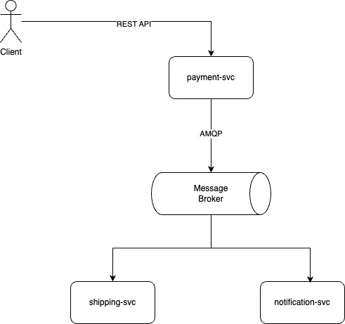

# Simple Message Broker Implementation using AMQP

This project demonstrates a simple message broker implementation to facilitate communication between multiple services using AMQP (Advanced Message Queuing Protocol). The architecture follows a publish-subscribe pattern, where a payment service sends messages to a message broker, which then distributes these messages to other services such as shipping and notification services.

## Architecture Diagram



## Table of Contents

- [Introduction](#introduction)
- [Technologies Used](#technologies-used)
- [Setup and Installation](#setup-and-installation)
- [Running the Services](#running-the-services)
- [Usage](#usage)
- [Contributing](#contributing)

## Introduction

The goal of this project is to create a simple message broker system that enables asynchronous communication between different services. This setup is common in microservices architecture where decoupling services is essential for scalability and maintainability.

## Technologies Used

- **REST API:** Used for communication between the client and the payment service.
- **AMQP:** Used as the protocol for message brokering.
- **Message Broker:** Acts as an intermediary to relay messages between services.

## Setup and Installation

### Prerequisites

- Docker
- Docker Compose

### Steps

1. **Clone the repository:**

    ```bash
    git clone <repository-url>
    cd <repository-directory>
    ```

2. **Start the services:**

    ```bash
    docker-compose up --build
    ```

This will set up the payment service, message broker, shipping service, and notification service.

## Running the Services

### Payment Service

The payment service exposes a REST API for the client to send payment requests.

- **Endpoint:** `POST /payment`
- **Payload:** 

    ```json
    {
        "account_no": "001232323",
        "bank_name": "BCA",
        "account_name": "Intan Ogiwara"
    }
    ```

### Message Broker

The message broker uses AMQP to relay messages from the payment service to the shipping and notification services.

### Shipping Service

The shipping service listens for messages related to order shipments.

### Notification Service

The notification service listens for messages related to notifications.

## Usage

1. **Send a payment request:**

    ```bash
    curl -X POST http://localhost:8080/payment -H "Content-Type: application/json" -d '{"account_no": "12345", "bank_name": "BCA", "account_name": "Intan Ogiwara"}'
    ```

2. **Check logs:**

    - Payment service logs will show the request being processed and the message being sent to the message broker.
    - Shipping and notification services will show the received messages and the corresponding actions.

## Contributing

Contributions are welcome! Please fork the repository and submit a pull request for any enhancements or bug fixes.
